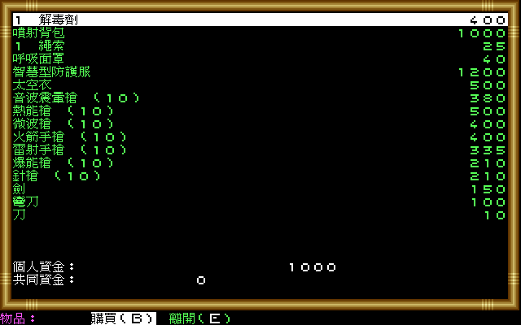

# 《拯救地球》DOS 輸出端繁體中文化

本專案讓原版 DOS《Buck Rogers: Countdown to Doomsday》在 dosgolem 執行時，以輸出攔截
方式覆繪繁體中文。它不是 remake、不是修改原版 EXE，也不重新實作遊戲規則；原版要求
玩家查閱手冊時，目標是直接在同一事件中顯示相應的中文手冊段落，而不繞過答案判定。

> 本專案仍在開發中，尚無可供一般玩家下載的完成版或 Release。已證實範圍與下一個驗收
> 閘門以 [CONTEXT.md](CONTEXT.md) 為準。

原版 39 題手冊查閱事件均已有對應的遊戲內繁中說明段落；其中 35 題另在段落下方列出英文原文前 N 字
並標出第 N 字，讓沒有英文手冊的玩家也能作答（英文取自使用者本機的手冊快照，不在本儲存庫）。
這不等於整本手冊逐字翻譯，逐題執行期試玩也尚未完成。翻譯與來源邊界見[第一百階段證據](docs/re/phase-100-manual-39-translation.md)。

## 畫面預覽

以下是 dosgolem 執行原版時的覆繪輸出（2×）。玩家名、`NEO`、`ENTER` 等專名與按鍵名刻意保留原文。

| | |
|---|---|
|  角色建立：種族選擇 |  讀檔後的隊伍與功能選單 |
|  Salvation III 站內 |  交誼廳與水平選單 |
|  補給站購買清單 |  發射前的基地司令訊息 |
|  廢棄飛船敘事（組句碎片接入） |  手札直接在遊戲內顯示 |
|  角色物品畫面 | |

截圖是本專案輸出的展示用途，仍含原版美術，只放在 private repo；公開 repo 或發行包前會移除
（見 [AGENTS.md](AGENTS.md)）。

## 遊戲與歷史背景

《Buck Rogers: Countdown to Doomsday》由 Strategic Simulations, Inc.（SSI）開發及發行，
DOS、Commodore 64 與 Amiga 版皆在 1990 年推出；DOS 版另有臺灣發行紀錄。作品獲 TSR
授權，屬 Buck Rogers XXVc 科幻角色扮演設定。[MobyGames 的版本資料](https://www.mobygames.com/game/489/buck-rogers-countdown-to-doomsday/releases/)
列出各平台、開發／發行及授權資訊，[DOS 製作名單](https://www.mobygames.com/game/489/buck-rogers-countdown-to-doomsday/credits/dos/)
則保存專案領導、程式、遭遇設計與美術等署名。（來源查閱：2026-09-20）

它把 SSI 的 Gold Box 系統由 AD&D 奇幻戰場帶到太陽系科幻舞臺。SSI 自己在 1992 年產品
目錄中稱本作使用「特別強化」的 Gold Box 電腦角色扮演系統；因此這項系列關係不是只靠
後世外觀分類。[SSI 1992 年產品目錄](https://www.mocagh.org/ssi/ssi-92catalog.pdf)（掃描典藏；
來源查閱：2026-09-20）

玩家建立六人小隊，在 NEO 與 RAM 對抗的 XXVc 世界中接受任務；遊玩會在太陽系／地方地圖
移動、第一人稱區域探索、角色與裝備管理，以及等角視角的回合制戰鬥之間切換，並包含太空
航行與艦艇遭遇。[MobyGames 遊戲資料頁](https://www.mobygames.com/game/489/buck-rogers-countdown-to-doomsday/)
整理了角色建立、導航模式與戰鬥結構；原版包裝所附 Rule Book、Log Book 與 Data Card 也
顯示手冊是正常遊玩流程的一部分。[原版 Rule Book 的保存掃描](https://mocagh.org/ssi/doomsday-manual.pdf)
（來源查閱：2026-09-20）

這款作品的保存價值不只在某一場戰鬥或一張地圖，而在多種顯示模式、資料密集的隊伍系統、
戰術戰鬥、太空旅行與紙本手冊共同構成的完整體驗。也正因手冊同時承擔規則說明、長篇敘事
與遊戲內查詢，本專案把「在原版事件中呈現可讀繁中內容」視為保存操作體驗的一部分，而非
把驗證流程移除。

## 中文化方式

- dosgolem 執行玩家自備的原版程式與資料，原版英文繪製流程保持存在。
- 只有經原版 trace 證實的呼叫位置、原文與畫面區域，才能觸發繁中覆繪。
- 翻譯只能影響顯示，不得進入條件比較、資料查找、檔名、序列化或存檔。
- 手冊題目由原版照常抽取、顯示及判定；中文段落只在相應事件完整成立時出現。
- 每條正式路徑都必須由 dosgolem 以相同初始狀態與輸入驗證，差異限於核准的覆繪區域。

目前已完成可重播的原版啟動、文字 dispatcher／清除生命週期、手冊題庫與繁中段落映射、
整數倍率點陣 renderer、手冊事件 Collector／Catalog，以及由真實原版事件產生繁中
`DisplayRequest` 的 runtime watcher。倚天字型與手冊呈現鏈已接入 dosgolem 重播命令；
已抽樣命中的三道手冊題均能顯示中文；2× 維持原大小，3× 中文字放大並縮小字距。
雙倍率均通過原版完整狀態與像素區域比較。
正確作答後的手冊覆繪返回已驗證；尚未提供互動式玩家前端，也未完成全部題目與
手冊後存讀檔驗收，不宣稱全遊戲中文化完成。
開發重跑入口與限制見 [第三題抽樣收據](docs/re/phase-103-manual-third-question-runtime.md)。

## 原版資料與權利邊界

本儲存庫不包含原版遊戲、原版 EXE、資料檔、存檔、掃描手冊、OCR 全文、音樂、美術，
或其他可還原受保護內容；唯一例外是上方少量覆繪後的展示截圖，僅限 private repo。研究與執行所需的原版遊戲及手冊必須由使用者合法自備；
它們只在被 Git 忽略的本機工作區使用，不會加入 GitHub 或公開發行包。

本專案是獨立的保存與在地化工程，與 Strategic Simulations、TSR、Buck Rogers 的權利人
及其他原權利人沒有隸屬或背書關係。未來若提供可散布工具包，也只會包含本專案程式、
翻譯及具相容授權的字型，並要求使用者在本機匯入合法原版資料。

## 執行與目前交付狀態

目前沒有穩定的一般玩家安裝／啟動入口，也沒有 GitHub Release。開發驗證使用本機
`workplace/dosgolem/` 的 `buck-rogers-cht-output-overlay` 分支；該副本與原版輸入均不在
本儲存庫的可散布內容中。在 Issue #10 的匯入流程及封包驗收完成以前，請勿把研究命令或
本機固定狀態當成發行方式。

## 文件導航

- [AGENTS.md](AGENTS.md)：專案邊界、證據閘門、Docker 與權利規則。
- [CONTEXT.md](CONTEXT.md)：目前已證實能力、限制與下一個決策。
- [分期目標](docs/goals/README.md)：每個階段的範圍與退出條件。
- [研究證據索引](docs/re/README.md)：原版位址、實驗、收據與推論等級。
- [規格目錄](docs/spec/)：DRAFT／READY／CONFORMED 規格。
- [WORKLOG.md](WORKLOG.md)：按時間追加的工作歷程。
- [GitHub Issues](https://github.com/wicanr2/buck-rogers-countdown-to-doomsday-cht/issues)：唯一的可執行工作清單。

所有外部歷史來源連結最後查閱於 2026-09-20。
