# 《拯救地球》DOS 輸出端繁體中文化

本專案讓原版 DOS《Buck Rogers: Countdown to Doomsday》在 dosgolem 執行時，以輸出攔截
方式覆繪繁體中文（另有簡體中文、日文、韓文，見下方「語言」）。它不是 remake、不是修改原版 EXE，也不重新實作遊戲規則；原版要求
玩家查閱手冊時，目標是直接在同一事件中顯示相應的中文手冊段落，而不繞過答案判定。

> 已發佈 [Release](https://github.com/wicanr2/buck-rogers-countdown-to-doomsday-cht/releases)（Linux、Windows、macOS），
> 需自備原版遊戲；已證實的範圍與下一個驗收閘門以 [CONTEXT.md](CONTEXT.md) 為準，尚未量到的輸出路徑仍顯示英文。

原版 39 題手冊查閱事件均已有對應的遊戲內繁中說明段落；其中 35 題另在段落下方列出英文原文前 N 字
並標出第 N 字，讓沒有英文手冊的玩家也能作答（英文取自使用者本機的手冊快照，不在本儲存庫）。
這不等於整本手冊逐字翻譯，逐題執行期試玩也尚未完成。翻譯與來源邊界見[第一百階段證據](docs/re/phase-100-manual-39-translation.md)。

## 語言

F4 依序切換：繁體中文（預設）、簡體中文、英文原版、日文、韓文。簡體由繁體譯文以 OpenCC 加專案詞表產生（規格 041）。
日文（規格 042）與韓文（規格 043）以英文原文為源批次翻譯，為機器輔助譯文，未經母語者校對。玩家名依專案自訂的音譯規則轉成片假名與諺文（規格 044、045），規則同樣未經母語者校對；手冊題的段落顯示原版英文。
各語言只影響顯示，不改遊戲狀態與存檔。

## 畫面預覽

以下是 dosgolem 執行原版時的覆繪輸出（2×）。人名以「中文(英文)」顯示，窄欄只顯示中文；`NEO`、`ENTER` 等
專名與按鍵名保留原文。

| | |
|---|---|
| 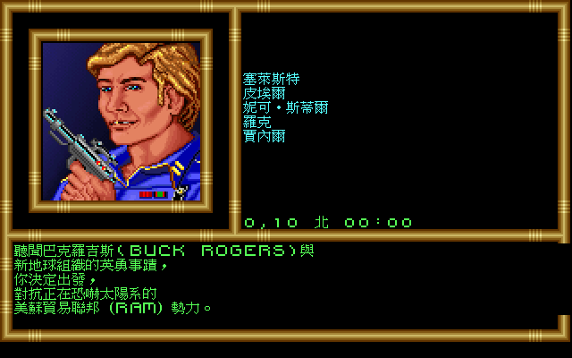 開場劇情第 1 頁 | 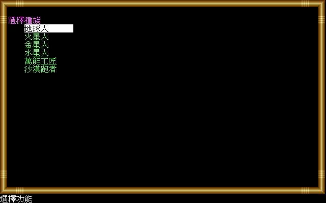 角色建立：種族選擇 |
| 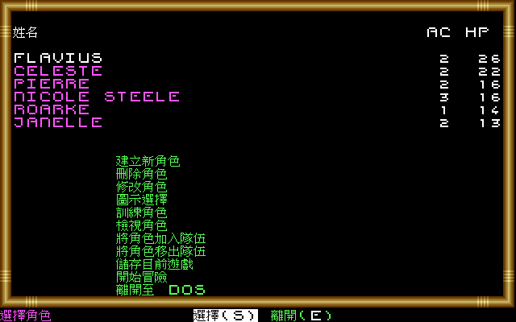 隊伍與功能選單（玩家名音譯） | 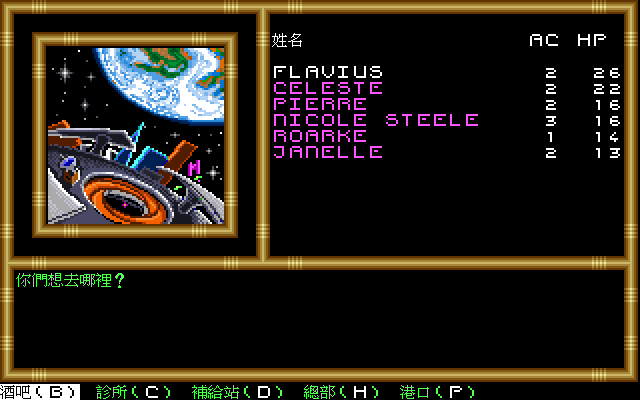 Salvation III 站內 |
| 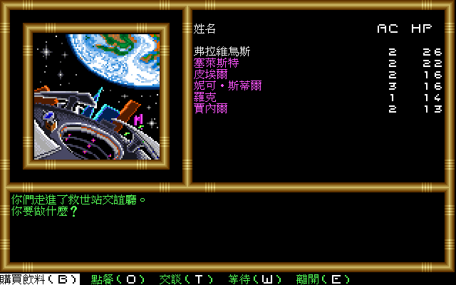 交誼廳與水平選單 | 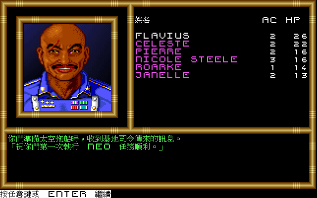 發射前的基地司令訊息 |
| 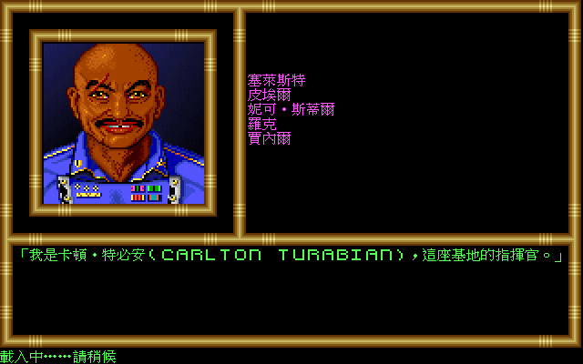 基地指揮官登場 | 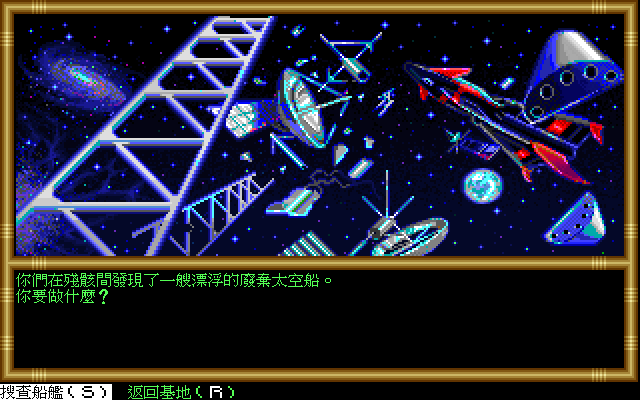 太空中發現廢棄飛船 |
| 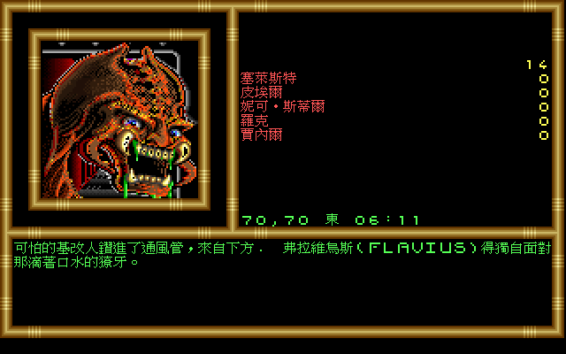 廢棄飛船敘事（玩家名接入句中） | 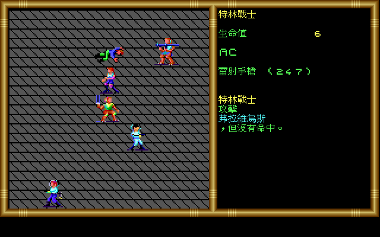 戰鬥畫面 |
| 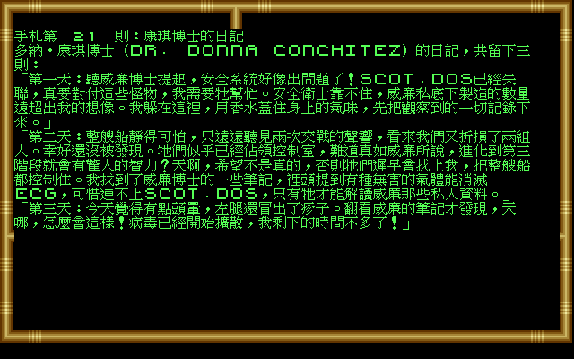 手札直接在遊戲內顯示 | 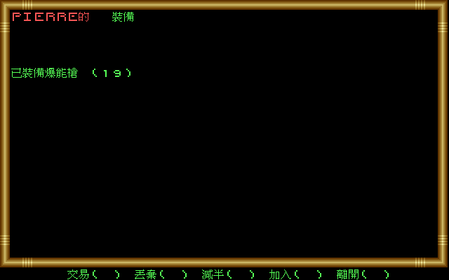 角色物品畫面 |

截圖以開發時的本機倚天字型拍攝；發行包改用 GNU Unifont，字形略有不同。
截圖是本專案輸出的展示用途，其中的美術與畫面配置屬原版權利人；發行包不附截圖
（見 [AGENTS.md](AGENTS.md)）。

## 故事簡介

> 「地球，文明的搖籃，已遭受嚴重破壞。」

二十五世紀的地球成了太陽系的垃圾傾倒場。美蘇貿易聯邦（RAM）的勢力在太陽系各處恐嚇人心，而站出來對抗它的是新地球組織（NEO）。靠著成千上萬名願意冒生命危險的人，NEO 開始把這顆殘破的星球重建成它本應有的模樣。巴克羅吉斯與 NEO 的事蹟一路傳開，你聽說之後，決定也加入這場對抗。

你和同批新進隊員被送到奇亞貢太空港受訓。才剛抵達，你們就被召進講堂，坐在不太舒服的椅子上，只想快點結束這場集合。交談聲漸漸停下，燈光熄滅，講堂前方亮起全息影像，一個聲音講起地球的遭遇。接著影像變成一張人臉，他微笑著說自己是卡頓•特必安（Carlton Turabian），將擔任你們的指揮官。他沒有多說，你們會被分派到 NEO 的秘密打撈站，先從打撈與巡邏任務做起；只要證明自己能勝任，戰鬥任務很快就會輪到你們。簡報結束，你們帶著基本裝備列隊離開，登上接駁艇，直接前往太空站。

在遊戲中，你要建立並帶領一支六人小隊，從打撈站的例行差事出發，在太陽系裡航行、接下任務，在 NEO 與 RAM 的對抗中證明自己。

## 遊戲與歷史背景

《Buck Rogers: Countdown to Doomsday》由 Strategic Simulations, Inc.（SSI）開發及發行，
DOS、Commodore 64 與 Amiga 版皆在 1990 年推出；DOS 版另有臺灣發行紀錄。作品獲 TSR
授權，屬 Buck Rogers XXVc 科幻角色扮演設定。[MobyGames 的版本資料](https://www.mobygames.com/game/489/buck-rogers-countdown-to-doomsday/releases/)
列出各平台、開發／發行及授權資訊，[DOS 製作名單](https://www.mobygames.com/game/489/buck-rogers-countdown-to-doomsday/credits/dos/)
則保存專案領導、程式、遭遇設計與美術等署名。（來源查閱：2026-09-20）

它把 SSI 的 Gold Box 系統由 AD&D 奇幻戰場帶到太陽系科幻舞臺。SSI 自己在 1992 年產品
目錄中稱本作使用「特別強化」的 Gold Box 電腦角色扮演系統；因此這項系列關係不是只靠
後世外觀分類。[SSI 1992 年產品目錄](https://www.mocagh.org/ssi/ssi-92catalog.pdf)（掃描典藏；
來源查閱：2026-09-20）

玩家建立六人小隊，在 NEO 與 RAM 對抗的 XXVc 世界中接受任務；遊玩會在太陽系／地方地圖
移動、第一人稱區域探索、角色與裝備管理，以及等角視角的回合制戰鬥之間切換，並包含太空
航行與艦艇遭遇。[MobyGames 遊戲資料頁](https://www.mobygames.com/game/489/buck-rogers-countdown-to-doomsday/)
整理了角色建立、導航模式與戰鬥結構；原版包裝所附 Rule Book、Log Book 與 Data Card 也
顯示手冊是正常遊玩流程的一部分。[原版 Rule Book 的保存掃描](https://mocagh.org/ssi/doomsday-manual.pdf)
（來源查閱：2026-09-20）

這款作品的保存價值不只在某一場戰鬥或一張地圖，而在多種顯示模式、資料密集的隊伍系統、
戰術戰鬥、太空旅行與紙本手冊共同構成的完整體驗。也正因手冊同時承擔規則說明、長篇敘事
與遊戲內查詢，本專案把「在原版事件中呈現可讀繁中內容」視為保存操作體驗的一部分，而非
把驗證流程移除。

## 中文化方式

- dosgolem 執行玩家自備的原版程式與資料，原版英文繪製流程保持存在。
- 只有經原版 trace 證實的呼叫位置、原文與畫面區域，才能觸發繁中覆繪。
- 翻譯只能影響顯示，不得進入條件比較、資料查找、檔名、序列化或存檔。
- 手冊題目由原版照常抽取、顯示及判定；中文段落只在相應事件完整成立時出現。
- 每條正式路徑都必須由 dosgolem 以相同初始狀態與輸入驗證，差異限於核准的覆繪區域。

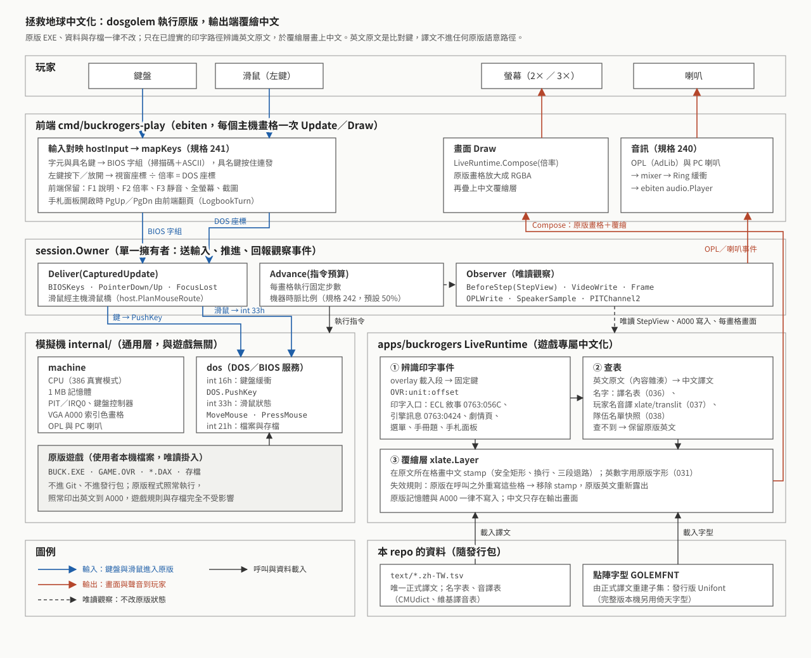

架構分三層：

- **前端**（`cmd/buckrogers-play`）：把鍵盤轉成 BIOS 按鍵字組，把滑鼠左鍵換算成 DOS 座標；
  說明、倍率、靜音、全螢幕、截圖由前端自己處理，不送進遊戲。
- **dosgolem**：`session.Owner` 把按鍵放進 `int 16h` 鍵盤緩衝、把滑鼠狀態交給 `int 33h`，
  再依機器時脈推進原版程式；執行中以唯讀方式回報每步進入點、畫面寫入與聲音事件。
- **LiveRuntime**（`apps/buckrogers`）：用 overlay 固定鍵辨識原版的印字呼叫，以英文原文查
  `text/*.zh-TW.tsv` 的譯文，在覆繪層畫中文；原版之後重寫同一格時覆繪自動移除。

目前已接通開場劇情、選單、敘事窗、引擎訊息、手札、手冊查詢題段落，以及角色與隊伍畫面的
姓名顯示；玩家前端含鍵盤、滑鼠與音訊。本機沒有進度可達的路徑（例如第 5 章之後、太空戰鬥）
尚未量測，遇到時保留原版英文，不宣稱全遊戲中文化完成。

## 原版資料與權利邊界

本儲存庫不包含原版遊戲、原版 EXE、資料檔、存檔、掃描手冊、OCR 全文、音樂、美術，
或其他可還原受保護內容；唯一例外是上方少量覆繪後的展示截圖。研究與執行所需的原版遊戲及手冊必須由使用者合法自備；
它們只在被 Git 忽略的本機工作區使用，不會加入 GitHub 或公開發行包。

本專案是獨立的保存與在地化工程，與 Strategic Simulations、TSR、Buck Rogers 的權利人
及其他原權利人沒有隸屬或背書關係。發行包只包含本專案程式、翻譯及具相容授權的字型，
並要求使用者在本機匯入合法原版資料。推廣影片的配樂是原版遊戲音樂（DOSBox-X 執行原版錄製），
著作權屬原權利人。

## 下載與執行

到 [Releases](https://github.com/wicanr2/buck-rogers-countdown-to-doomsday-cht/releases) 下載對應平台的發行包：
Linux AppImage、Windows zip、macOS zip（universal）。發行包不附原版遊戲，請自備 DOS 英文版，
把原版資料夾放成程式旁邊的 `original/`；第一次啟動會核對 `START.EXE`、`GAME.OVR` 雜湊並匯入到使用者資料目錄。
按鍵、存檔位置與 macOS 未簽章的開啟方式見發行包內的 `讀我.txt`（[原文](docs/release/讀我.txt)）。

已中文化的範圍以 [研究證據索引](docs/re/README.md) 的收據為準；尚未量到的輸出路徑仍會顯示英文。
發行包由 `tools/package.sh` 建置，驗收見 [phase-280](docs/re/phase-280-release-packaging.md)。

## 授權、致謝與聲明

本專案採 [RRSAL-1.0](LICENSE)（復古重製 source-available 授權條款）：非商業用途免費，含修改與再散布；
實況、影片、評論與報導明示允許；商業用途請洽 wicanr2@gmail.com，歡迎來談。它不是 open source 授權，
也不涵蓋原版遊戲、手冊、美術與音樂。

發行包另含第三方元件，各依自身授權：dosgolem 執行器（RRSAL-1.0，其中 Nuked OPL3 的 Go 移植依
LGPL-2.1-or-later）、GNU Unifont 字型（SIL OFL-1.1／GPL-2.0-or-later 含字型嵌入例外）、CMU 發音詞典（BSD 式授權）、
英語人名譯音表（CC BY-SA 4.0，改作自中文維基百科）、Ebiten 遊戲程式庫及其相依套件。

## 文件導航

- [AGENTS.md](AGENTS.md)：專案邊界、證據閘門、Docker 與權利規則。
- [CONTEXT.md](CONTEXT.md)：目前已證實能力、限制與下一個決策。
- [分期目標](docs/goals/README.md)：每個階段的範圍與退出條件。
- [研究證據索引](docs/re/README.md)：原版位址、實驗、收據與推論等級。
- [規格目錄](docs/spec/)：DRAFT／READY／CONFORMED 規格。
- [WORKLOG.md](WORKLOG.md)：按時間追加的工作歷程。
- [GitHub Issues](https://github.com/wicanr2/buck-rogers-countdown-to-doomsday-cht/issues)：唯一的可執行工作清單。

所有外部歷史來源連結最後查閱於 2026-09-20。
